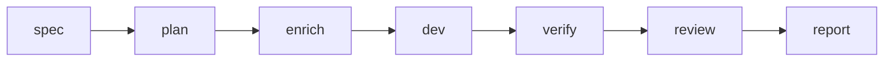

# Kiro → Cursor → Vérification

Workflow de transfert des specs Kiro vers l'implémentation Cursor avec les barrières AgentFlow (`spec-doc` §11.2).

## Quand l'utiliser

Vous conservez exigences et tâches dans **Kiro** (`.kiro/specs/<feature>/`) mais souhaitez **Cursor** (ou `cursor-agent`) pour l'implémentation, avec étapes verify/review obligatoires.

## Pipeline



## Commandes

Remplacez `billing-v2` par l'identifiant de votre feature :

```bash
agentflow spec billing-v2 --agent kiro
agentflow plan billing-v2
agentflow enrich billing-v2 --agent ollama
agentflow dev billing-v2 --agent cursor
agentflow verify billing-v2
agentflow review billing-v2 --agent codex
agentflow report <run-id>
```

Utilisez `--dry-run` sur chaque étape pendant la répétition :

```bash
agentflow dev billing-v2 --agent cursor --dry-run
```

## Valeurs par défaut de configuration

Depuis `.agentflow/config.yaml.example` :

```yaml
work:
  default_agent: cursor
  default_reviewer: codex
  default_enricher: ollama
  auto_verify: true
  auto_review: false
```

Ne réglez `work.auto_review: true` que si vous souhaitez une revue après chaque verify réussi.

## Raccourci par intention

```bash
agentflow work "develop billing-v2" --stop-after verify
```

La résolution d'intention choisit la feature ; le pipeline V3 applique budgets et optimisation de contexte.

## Modes de défaillance

| Symptôme | Correctif |
| --- | --- |
| `kiro` absent du PATH | Définir `agents.kiro.command` ou installer la CLI Kiro |
| Échec de verify | Corriger les tests localement ; utiliser `agentflow verify billing-v2 --force` seulement si la machine d'état l'autorise |
| Git dirty bloqué | Commit/stash ou ajuster `policies.require_clean_git` |

## Voir aussi

- [CLI : spec](/docs/cli/generated/spec)
- [CLI : dev](/docs/cli/generated/dev)
- [Vue d'ensemble architecture](/docs/fr/architecture/overview)
