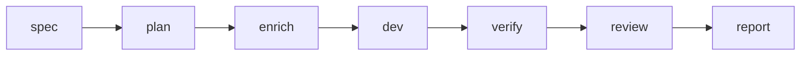

# Kiro → Cursor → Verify

Ce passage à l’échelle aligne **`spec-doc` §11.2** avec portes AgentFlow — la rédaction reste sous **Kiro** (`.kiro/specs/<feature>/`), Cursor / `cursor-agent` portent l’implémentation où il excelle ; la CLI impose des étapes **verify**/**review** déterministes empêchant dérive muette.

## Quand vous y recourez

Exigez specs + tâches Kiro mais mise en œuvre Cursor agentique avec garde fou verify/reviews obligés.

## Pipeline

Représentation indicative — rapport final utilise toujours identifiants persistant :



## Commandes

Remplacez `billing-v2` par votre feature :

```bash
agentflow spec billing-v2 --agent kiro
agentflow plan billing-v2
agentflow enrich billing-v2 --agent ollama
agentflow dev billing-v2 --agent cursor
agentflow verify billing-v2
agentflow review billing-v2 --agent codex
agentflow report <run-id>
```

Répète possible avec `--dry-run` durant mise en plateau :

```bash
agentflow dev billing-v2 --agent cursor --dry-run
```

## Defaults configuration

Snippet provenant exemple :

```yaml
work:
  default_agent: cursor
  default_reviewer: codex
  default_enricher: ollama
  auto_verify: true
  auto_review: false
```

Activer auto review seulement quand désirez revues systématiques à chaque verify vert.

## Raccourci intention

```bash
agentflow work "develop billing-v2" --stop-after verify
```

Résolveur intentions choisi feature flux V3 impose budgets/context.

## Diagnostics

| Symptôme | Remède |
| --- | --- |
| `kiro` absent PATH | Ajuster agents.kiro.command ou installer CLI |
| Verify échoue | Corrigez puis `--force` seulement où machine états permet |
| git sale bloquant | commits stash ou assouplit policy clean |

## Voir aussi

- [CLI spec](/docs/fr/cli/generated/spec)
- [CLI dev](/docs/fr/cli/generated/dev)
- [Architecture](/docs/fr/architecture/overview)
