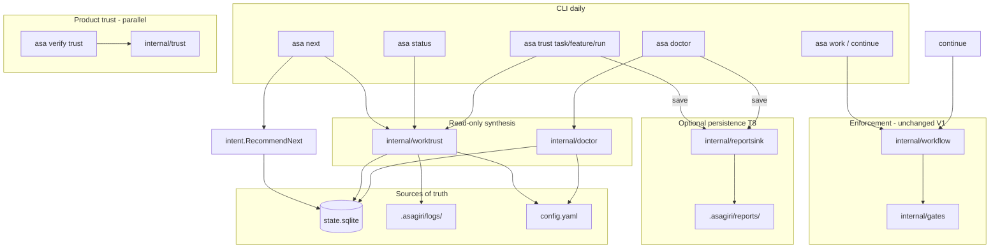

# ADR-033 — Trust & Diagnostic Architecture

**Date :** 2026-06-07  
**Status :** accepted  
**Spec :** [`.kiro/specs/trust-engine-v1/`](../../.kiro/specs/trust-engine-v1/) (T1–T8 livrés)

## Context

Asagiri expose aujourd’hui **plusieurs surfaces de confiance et de diagnostic** qui se chevauchent sémantiquement mais **ne fusionnent pas** :

| Famille | Package | Rôle |
|---------|---------|------|
| Work trust synthesis | `internal/worktrust` | Synthèse read-only des **work gates** (plan, enrich, governance, verify_evidence, human_review) |
| Product trust engine | `internal/trust` | Checks déterministes spec-my-B, confidence 6D, `asa verify trust` |
| Work gates runtime | `internal/gates` + `internal/workflow` | Exécution et **enforcement** des gates (`PendingGate`, retries, blocages pipeline) |
| Diagnostic | `internal/doctor` | Hygiène dépôt / config / agents / onboarding |
| Report persistence | `internal/reportsink` | Snapshots JSON opt-in (`--save`) |

Sans cadre explicite, les opérateurs confondent **verdict advisory** (worktrust), **seuil de livraison** (`verify trust`), et **blocage workflow** (gates). Trust Engine V1 (T1–T8) a livré la couche opérationnelle ; cette ADR en fixe l’architecture durable et les extensions futures.

## Decision

### 1. Trust Engine — work synthesis (`internal/worktrust`)

#### 1.1 Positionnement

- **Read-only** : aucune mutation SQLite, payload tâche, ni transition workflow.
- **Sources V1** : `gates.history` / `governance.history` (payload tâche), logs `.asagiri/logs/<scope>/gates/*.json`, `validation/results.json`, statut métier tâche, `gates.BlockingPendingForTask`, config `work.gates.*`.
- **Distinct de** `internal/trust` (ADR-020/021) : pas de checks produit, pas d’artefacts `.asagiri/trust/<id>/` obligatoires, pas de gate `verification:` config.

#### 1.2 Scopes

| Scope | Entrée | Agrégation | JSON `scope.kind` |
|-------|--------|------------|-------------------|
| **Task** | `BuildTaskReport(repo, cfg, task)` | 1 tâche | `"task"` |
| **Feature** | `BuildFeatureReport(repo, cfg, feature, tasks)` | N tâches | `"feature"` |
| **Run** | `BuildRunReport(repo, cfg, store, runID)` | tâches du run + plan gate run | `"run"` |

Règles d’agrégation feature/run (V1, stables) :

- **Verdict feature/run** = pire verdict parmi les tâches (`blocked` > `risky` > `acceptable` > `trusted`).
- **Score feature/run** = moyenne arithmétique des scores task (dimensions recalculées au niveau task uniquement).
- **Run** : signal complémentaire **plan gate** via `.asagiri/logs/<run-id>/gates/plan.json`.

#### 1.3 Scoring

Six dimensions fixes (V1), pondérées dans `scorer.go` :

| Dimension | Poids | Signaux principaux |
|-----------|-------|-------------------|
| `specification_alignment` | 0.15 | plan, enrich |
| `implementation_quality` | 0.10 | governance, statut impl |
| `validation_strength` | 0.25 | résultats validation, verify |
| `gate_confidence` | 0.25 | historique gates actives |
| `human_confidence` | 0.20 | human_review |
| `residual_risk` | 0.05 | pénalités croisées, pending HR |

- Score dimension : 0–100 ou `UnevaluatedScore` (-1) si gate inactive / non atteinte.
- **Overall** : moyenne pondérée des dimensions évaluées (poids renormalisés).
- Seuils verdict (constants V1, configurables T2+ via `trust_synthesis:`) :
  - ≥ 80 → `trusted`
  - ≥ 60 → `acceptable`
  - ≥ 40 → `risky`
  - sinon → `blocked`, ou **hard blocked** si pending HR / fail gate / statuts `verify_failed` / `failed`.

#### 1.4 Verdicts & UX

| Machine (`Verdict`) | Terminal (FR) | Sémantique |
|---------------------|---------------|------------|
| `trusted` | Fiable | Peu de risque résiduel gate-detectable |
| `acceptable` | Acceptable | Progrès normal ; surveillance légère |
| `risky` | À surveiller | WARN non satisfaisant ou signaux faibles |
| `blocked` | Bloqué | Action opérateur requise avant suite |

- Score numérique **masqué par défaut** ; `--explain` expose dimensions / scores task.
- **Confidence ≠ correctness** (ADR-021) s’applique par analogie : worktrust mesure couverture gate, pas preuve formelle.

#### 1.5 Next actions

Deux producteurs complémentaires, **harmonisés** sur `asa next` :

| Producteur | Rôle | Priorité |
|------------|------|----------|
| `intent.RecommendNext` | Planner canonique (état SQLite + `PendingGate`) | **Autorité workflow** |
| `worktrust.buildRecommendation` | Heuristique advisory dans le rapport trust | **Conseil** ; converge vers `asa next --feature <f>` en cas de dégradation |

Feature/run : next action agrégée = `asa next --feature <feature>` (`NextCommandForFeature`).

**Règle V1 :** trust **ne remplace pas** le planner ; il **reflète** et **oriente** vers les mêmes primitives CLI.

---

### 2. Daily UX — opérateur au quotidien

Couche **présentation** read-only au-dessus de worktrust + intent + doctor :

```text
                    ┌─────────────────────────────────────┐
                    │  Opérateur                          │
                    └──────────┬──────────────────────────┘
         ┌─────────────────────┼─────────────────────┐
         ▼                     ▼                     ▼
   asa next / status     asa work / continue    asa doctor
         │                     │                     │
         ▼                     ▼                     ▼
  intent.RecommendNext    workflow runtime    doctor.Build
  + worktrust daily       + post-work trust   (+ onboarding)
```

| Commande | Rôle | Trust / diagnostic |
|----------|------|-------------------|
| **`asa next`** | Prochaine primitive recommandée ; `--execute` pour lancer | Bloc Trust compact (task courante) sauf `--no-trust` |
| **`asa status`** | Vue feature active (runs/tasks) | Section Trust (verdict, tasks à risque, → next) sauf `--no-trust` |
| **`asa work`** | Pipeline guidé intent → plan → … | Ligne trust post-exécution réelle |
| **`asa continue`** | Reprise feature + gate-aware | Idem post-exécution |
| **`asa trust task\|feature\|run`** | Rapport complet (sections Summary, Gates, Risks, Next actions) | Source détaillée ; `--json`, `--explain`, `--save` |
| **`asa doctor`** | Hygiène machine + projet | Synthèse trust feature active (read-only) + prochaines actions |

**Séparation des concerns :**

- **Navigation** (`next`, `continue`, `work`) → exécution ou recommandation d’exécution.
- **Évaluation** (`trust`, blocs daily) → lecture seule, jamais bloquante en V1.
- **Diagnostic** (`doctor`) → prérequis environnement ; exit code CI-friendly (FAIL bloquant, WARN toléré sauf `--strict`).

Documentation opérateur : docs-site `concepts/mental-model`, `workflows/daily-workflow` (T7).

---

### 3. Persistent reports — lifecycle & contrats

#### 3.1 Lifecycle (V1 — T8)

```text
Sources live (SQLite, logs, config)
        │
        ▼
  Build report (worktrust / doctor)     ← toujours recalculé à la demande
        │
        ├── stdout (texte ou JSON pur si --json)
        │
        ├── stderr (si --save) ──► Rapport enregistré : …
        │
        └── --save ──► reportsink (atomic write)
                        .asagiri/reports/...
```

| Propriété | V1 |
|-----------|-----|
| Déclenchement | **Opt-in** CLI `--save` uniquement |
| Relecture auto | **Interdite** — aucun code ne lit les snapshots pour scorer ou planner |
| Cache implicite | **Aucun** |
| Base de données | **Aucune** — fichiers JSON uniquement |
| Atomicité | `CreateTemp` + `Rename` dans le répertoire cible |
| Streams CLI | `--json` → stdout JSON pur ; `--save` → confirmation `Rapport enregistré : …` sur **stderr** |

Chemins stables :

```text
.asagiri/reports/trust/tasks/<task-id>.json
.asagiri/reports/trust/features/<feature>.json
.asagiri/reports/trust/runs/<run-id>.json
.asagiri/reports/doctor/latest.json
```

- IDs validés via `trust/safeid` (pas de `..`, `/`, `\`).
- Doctor : **un seul** `latest.json` (overwrite à chaque save).

#### 3.2 JSON contracts

| Artefact | `report_version` | Type Go | Champs stables |
|----------|------------------|---------|----------------|
| Trust task | `"1"` | `WorkTrustReport` | `scope`, `score`, `dimensions`, `findings`, `evidences`, `recommendation`, `generated_at` |
| Trust feature | `"1"` | `FeatureTrustReport` | + `tasks[]`, `task_count`, `next_actions[]` |
| Trust run | `"1"` | `RunTrustReport` | + `plan_gate`, `next_actions[]` |
| Doctor | `"doctor-v1"` | `doctor.Report` | `ready`, `warnings`, `failures`, `checks`, `repository`, `state`, `gates`, `agents`, `next_actions` |

**Règle de compatibilité :** incrémenter `report_version` (ou suffixe `-v2`) pour tout changement breaking de schéma JSON. Les consommateurs externes (CI, dashboards) doivent filtrer sur ce champ.

#### 3.3 Versioning strategy

1. **V1 figée** : `report_version` constant par famille ; évolution additive préférée (nouveaux champs optionnels JSON).
2. **Breaking change** : bump version + période de support parallèle documentée.
3. **Config scoring** : bloc futur `trust_synthesis.thresholds/weights` (T2 backlog) — n’affecte pas le schéma JSON, seulement les valeurs calculées.
4. **Séparation spec-my-B** : `internal/trust.TrustReport` conserve son propre schéma sous `.asagiri/trust/<trust-id>/` (ADR-020) — **pas** unifié avec worktrust V1.

#### 3.4 History & diff (T11 — ADR-034)

| Extension | Statut T11 |
|-----------|------------|
| **History** | `history/` sous chaque scope ; archive avant overwrite sur `--save` |
| **Diff** | `asa doctor diff`, `asa trust diff task\|feature\|run` — latest vs dernière history |
| **Retention** | Pas de GC automatique ; rotation manuelle / gitignore |
| **Diff live** | Hors scope T11 (backlog) |

Le package `reportsink` reste le **seul writer** autorisé pour `.asagiri/reports/` afin de garantir atomicité et validation des segments.

---

### 4. Trust Gates (future) — enforcement vs read-only

#### 4.1 Problème

V1 livre trust **advisory** : un verdict `blocked` n’arrête pas `asa work`. Les **work gates** existantes (ADR-031/032) bloquent via `PendingGate` et runtime workflow — pas via worktrust.

#### 4.2 Deux moteurs, deux rôles

```text
┌──────────────────────┐         ┌──────────────────────┐
│  worktrust (V1)      │         │  workflow + gates    │
│  read-only synthesis │         │  enforcement         │
│  asa trust *         │         │  PendingGate, retries│
└──────────┬───────────┘         └──────────┬───────────┘
           │                                │
           │   Trust Gate (future)          │
           └──────────────► WorkTrustReportToGateResult()
                              → gates.Result
                              → PendingGate? / hook work
```

| Couche | Question | Peut bloquer ? |
|--------|----------|----------------|
| **worktrust** | « Quel est le niveau de confiance gate-visible ? » | Non (V1) |
| **work gates** | « Cette gate est-elle satisfaite ? » | Oui (human_review, enrich, …) |
| **Trust Gate work** (future) | « Le trust synthétisé autorise-t-il la suite ? » | Oui (spec `trust-gate-work`) |
| **verify trust** (spec-my-B) | « Le flow produit passe-t-il les checks ? » | Oui (`verification:` config) |

#### 4.3 Relation avec les rapports persistants

- `--save` produit des **témoins** pour audit CI/dashboard ; **pas** d’entrée automatique dans le moteur d’enforcement.
- Trust Gate future pourra **lire live** `BuildTaskReport` (ou seuil sur snapshot explicite passé en flag) — design à trancher dans `trust-gate-work` ; défaut recommandé : **live** pour éviter stale reports.

#### 4.4 Ponts spécifiés, non implémentés (ADR-032)

```go
// Future — work-gates-model Phase 6
func WorkTrustReportToGateResult(report worktrust.WorkTrustReport) gates.Result

// Parallèle spec-my-B (existant conceptuellement)
func TrustReportToGateResult(report trust.TrustReport) gates.Result
```

**Interdit sans ADR** : fusionner `internal/trust` et `internal/worktrust`, ou faire échouer `asa work` implicitement sur verdict `risky`.

---

### 5. Extension points

#### 5.1 Replay

| Système | Artefact | Usage |
|---------|----------|-------|
| **spec-my-B** | `.asagiri/trust/<id>/replay.yaml` | `asa trust replay` — rejeu checks produit |
| **worktrust** | Snapshots `.asagiri/reports/trust/…` | Comparaison manuelle / future diff ; **pas** de replay.yaml V1 |

Extension : manifest replay optionnel pointant vers un snapshot worktrust + hash des sources (gates.history, validation JSON).

#### 5.2 CI

Patterns recommandés (read-only, sans agent) :

```bash
asa init && asa doctor --full --strict --save 2>/dev/null
asa trust feature "$FEATURE" --json --save | jq -e '.score.verdict != "blocked"'
# ou artefact archivé :
jq -e '.score.verdict != "blocked"' ".asagiri/reports/trust/features/${FEATURE}.json"
```

- **Doctor** : gate hygiene (`--strict` sur WARN).
- **Trust save** : artefact archivable en CI ; **pas** de seuil officiel V1 dans le binaire (consommateur `jq`/policy externe).
- **verify trust** : pipeline produit distinct (`--ci --strict`) — ADR-020.

#### 5.3 Dashboards & UI

- **TUI / Mission Control** : consomme bus read-only (`GetRunDetailQuery`, trust summaries) — pas de logique scoring dans `ui/` (ADR-027/029).
- **Dashboards externes** : lire JSON `--save` ou appeler `asa trust * --json` ; champs stables listés §3.2.
- **Trust Explorer** (spec-ui backlog) : bind sur `WorkTrustReport` sections, pas sur `internal/trust` seul.

#### 5.4 Future analytics

| Idée | Source | Contrainte |
|------|--------|------------|
| Agrégat feature/release | snapshots `reports/trust/features/` | Offline ; pas de télémétrie cloud V1 |
| Trend verdict | history + timestamps | Nécessite §3.4 history |
| Corrélation gates ↔ trust | logs `.asagiri/logs/` + reports | Read-only batch |
| KG / investigation | `internal/knowledge` bridges (ADR-024) | Déjà read-only vers trust ; pas de write-back |

**Principe :** analytics **opt-in**, local-first, sans service distant.

---

## Architecture diagram (V1)



---

## Consequences

### Positives

- Vocabulaire stable pour opérateurs, CI et docs (mental model / daily workflow).
- Work trust, product trust et work gates restent **découplés** mais **documentés**.
- `--save` fournit des artefacts versionnables sans introduire de cache opaque.
- Trust Gate future a un point d’ancrage (`WorkTrustReportToGateResult`) sans refactor V1.

### Contraintes acceptées

- **Double homonymie « trust »** et **« gates »** maintenue (ADR-032) — clarifiée ici, pas renommée.
- **Recommendation** worktrust vs `RecommendNext` peut diverger marginalement ; harmonisation stricte = backlog T2.
- **Doctor `latest.json`** écrase l’historique — history = extension future.
- **Pas de Trust Gate** ni seuil CI built-in en V1.

### Non-goals (confirmés)

- Fusion `trust` / `worktrust`
- Lecture automatique des snapshots pour planner ou scorer
- Persistance obligatoire à chaque `asa trust`
- TUI Trust Explorer complet
- Télémétrie cloud des verdicts

---

## Related

| Document | Lien |
|----------|------|
| Spec Kiro | [`.kiro/specs/trust-engine-v1/`](../../.kiro/specs/trust-engine-v1/) |
| Work gates model | [`.kiro/specs/work-gates-model/`](../../.kiro/specs/work-gates-model/) |
| Handoff T1–T8 | [`docs/ai/active/handoff.md`](../ai/active/handoff.md) |
| ADR-020 / 021 | Product trust engine ; confidence ≠ correctness |
| ADR-032 | Trois familles gates/checks/verdict |
| Docs opérateur | docs-site `mental-model`, `daily-workflow` |
| Code | `internal/worktrust/`, `internal/doctor/`, `internal/reportsink/` |

## Follow-up (hors cette ADR)

- [ ] Mettre à jour `docs/ai/02-architecture.md` — section `worktrust` + `reportsink` (backlog handoff)
- [ ] Spec `trust-gate-work` — enforcement + `WorkTrustReportToGateResult`
- [ ] `trust_synthesis:` config thresholds (T2 backlog)
- [ ] History/diff reports (§3.4)
